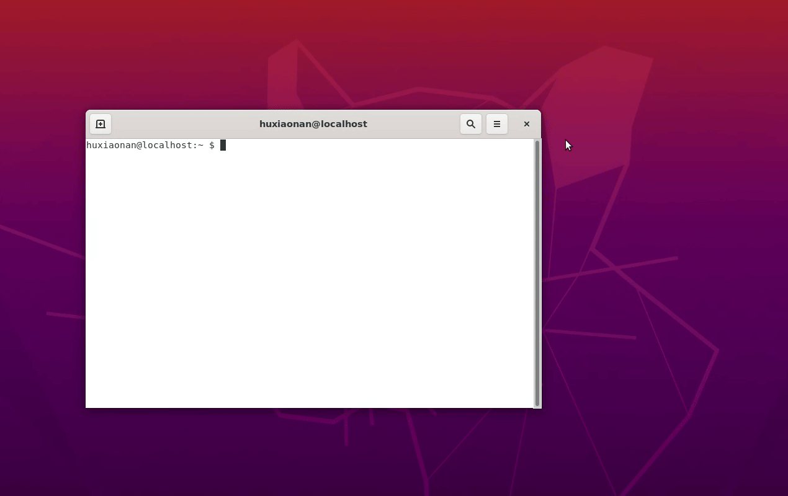

# Docker版Abaqus，兼容各种Linux版本，开箱即用

<p align="center">
  
</p>

本文分享了我制作的Abaqus 2021的Docker镜像，可以在任何装有Docker的Linux系统上运行（包括WSL），无需复杂的安装过程，开箱即用。[下载链接](#镜像下载)和[使用方法](#使用方法)详见后文。

For English readers, I am sorry that there is no English version of this README because this repository is primarily targeted at Chinese users and I do not have time to translate it into English. FYI, there are other repositories that provide similar solutions in English, such as [willfurnass/abaqus-2017-centos-7-singularity](https://https://github.com/willfurnass/abaqus-2017-centos-7-singularity), [ksHamburg/ABQ2021_on_ubuntu20.04](https://github.com/ksHamburg/ABQ2021_on_ubuntu20.04), and [danielabler/dockerfiles](https://github.com/danielabler/dockerfiles/tree/master/abaqus).

## 声明

本Abaqus Docker镜像为破解版，仅供学习研究，请勿用于商业用途。我坚决尊重软件开发商的知识产权，呼吁所有用户共同遵守相关法律法规。同时，我坚决支持国产工业软件的发展，认为国产工业软件在推动国家科技进步和产业升级方面发挥着至关重要的作用。

## 背景

在Linux上安装Abaqus要比在Windows上复杂一些，因为Linux版的Abaqus高度依赖系统的glibc以及其他库文件的版本。在具有高版本glibc的Linux系统上使用低版本Abaqus时，可能会遇到问题。

（要查看系统的glibc版本，可以使用命令 `ldd --version`）

Abaqus官方的Linux安装程序会检查系统的发行版信息，限制其只能安装在RHEL系列的系统上，但只要修改安装脚本，就可以绕过这一限制安装在其他发行版上（例如Ubuntu）。**然而，顺利安装并不意味着Abaqus能够成功运行。** 例如，根据[这个issue](https://github.com/willfurnass/abaqus-2017-centos-7-singularity/issues/5)，在glibc版本>=2.25的系统上，Abaqus 2020的standard求解器无法正常中止。尽管官方后来发布了Abaqus 2020的Hotfix版本修复了这个问题，但由于没有好心人发布该Hotfix版本的破解版，因此对于不花钱的用户来说，这个问题依然无法解决。

要避免glibc的兼容性问题，当然可以使用低版本glibc的系统，比如在CentOS 7这种老系统（glibc版本为2.17）上安装运行古董的Abaqus 6.14就没有问题。但是，一些现代化的软件早就抛弃低版本glibc了，比如VSCode从1.86版本开始要求远程服务器的glibc版本>=2.28。所以，要使用Abaqus就只能放弃新系统的便利性。

## 解决方案

据我所知，Abaqus虽然依赖glibc版本，但对Linux内核版本没什么要求。因此，可以利用容器技术在高版本系统上安装和运行低版本Abaqus。在安装有Docker的Linux系统中，只需要新建一个包含低版本glibc的Docker容器，就可以在其中安装和运行低版本Abaqus，而不会受到系统glibc版本的限制。

性能方面，完全无需担心。Docker的性能损失非常小，我在实际使用中，没感觉到Abaqus在Docker中和直接运行的速度有差别。

如果是在Windows中的WSL2中运行Docker，相比于直接在Windows中运行Abaqus，大概有15%的性能损失。不过这应该是WSL2的性能问题，而不是Docker的问题。

在Docker中运行Abaqus还能避免残留问题。如果容器中的Abaqus没能正常中止，可以直接删除容器，相应的Abaqus进程会被杀掉，Abaqus scratch目录中的临时文件也会被删除，不会残留。

使用Docker的另一个好处是快速部署。只要将Abaqus制作成Docker镜像，就可以将Abaqus部署到任何装有Docker的系统上运行，无需再次安装，真正实现**开箱即用**。Abaqus的Docker镜像的过程比较繁琐，无法通过Dockerfile自动化，需要先在基础容器中手动安装Abaqus，然后再commit成镜像。不过，这个过程只需要做一次，之后就能一劳永逸地使用了。

## 镜像下载

我制作了Abaqus 2021和Abaqus 2024的Docker镜像，可以在任何装有Docker的系统中运行。

我制作的镜像包含Standard、Explicit、CAE（可以使用GUI）、ODB API、以及Cosimulation Services，支持User Subroutines。不过，因为关联的是gfortran，不是Intel Fortran，我不保证所有User Subroutines都能正常工作。这个Abaqus镜像的详细制作过程详见后文：[镜像制作过程](#镜像制作过程)。

我应该不是国内第一个做Abaqus Docker镜像的人，Dockerhub上早就有了[其他人做的](https://hub.docker.com/search?q=abaqus)，但我这个应该是功能最全的，而且这份README也是目前最详细的。

| 镜像内容 | 文件名 | 大小 | 链接 | MD5 |
| --- | --- | --- | --- | --- |
| Abaqus 2021 | abq2021.tar.xz | 1.77 GiB | [清华大学云盘](https://cloud.tsinghua.edu.cn/f/64d14b75ef5246238f6e/?dl=1) | 4c599c6e16ba46c81a915d598349582c |
| Abaqus 2024 | abq2024.tar.xz | 3.38 GiB | [清华大学云盘](https://cloud.tsinghua.edu.cn/f/4088d4747d714f768803/?dl=1) | 8586471644d26d5a5aa2ff3a1ae3c5f4 |

（如果有需要，可以联系我制作其他版本的Abaqus的Docker镜像）

以上镜像已在以下Linux发行版上测试过：

- Abaqus 2021：CentOS 7、Ubuntu 20.04、WSL中的Ubuntu 24.04
- Abaqus 2024：Ubuntu 20.04

我没有把镜像上传到Dockerhub或Github Container Registry，主要有两点原因。一是国内访问这些网站受到限制，可能不方便拉取这么大的镜像。二是因为版权问题，毕竟是破解版软件，在国内传播就好，就不往外网传了。

## 使用方法

下文以Abaqus 2021镜像为例介绍使用方法。Abaqus 2024的使用方法类似，只需将镜像名和容器名分别改为abq2024和abq2024app即可。

### 导入镜像

下载abq2021.tar.xz到本地，使用xz解压缩，得到镜像的打包文件abq2021.tar：

```bash
xz -dv abq2021.tar.xz
```

使用以下命令导入镜像：

```bash
docker load -i abq2021.tar
```

导入镜像要几分钟。导入完成后，可以使用 `docker images` 命令查看镜像，或者使用VSCode的Docker插件查看镜像。


### 创建容器应用（不使用CAE图形界面）

若不需要使用CAE图形界面，则非常简单，只需使用以下命令创建一个名为abq2021app的容器。

```bash
docker run -d --mount type=bind,source=/home,target=/home --name abq2021app abq2021
```

该命令在创建容器时，将主机的 `/home` 目录挂载到容器的 `/home` 目录，这样容器内就可以直接访问主机 `/home` 目录下的文件。

创建这个容器一般只需几秒钟（不过我也曾遇到用时几分钟的情况，原因我也不清楚）。创建好容器后，就可以在容器中使用Abaqus了。


### 在容器中以root账户运行Abaqus

创建好容器后，就可以运行Abaqus了，默认是以root账户运行的。例如要求解Job-1.inp，可以用命令

```bash
docker exec -it abq2021app /bin/bash
```

进入容器，然后在容器中调用Abaqus：

```bash
cd /path/to/Job-1.inp
abaqus job=Job-1
```

或者也可以不进入容器，直接调用Abaqus。注意要加上 `--workdir` 参数指定工作目录。

```bash
cd /path/to/Job-1.inp
docker exec --workdir $(pwd) abq2021app abaqus job=Job-1
```

注意，在容器中以root账户运行Abaqus所产生的各种文件的权限均为root。

### 在容器中以非root账户运行Abaqus

要让docker中的Abaqus以特定用户的权限读写宿主机的文件，就需要在容器中创建一个与宿主机用户具有相同UID和GID的用户，并且在exec时通过参数 `--user UID:GID` 指定这个UID和GID。如果容器中没有这个UID，还使用 `--user UID:GID` 强行指定UID和GID，那Abaqus许可证服务将无法正常运行。

例如，宿主机有个用户叫zhangsan，UID和GID都是1001，那么只需要在容器中创建一个UID和GID都是1001的用户（无论叫不叫zhangsan都行），然后指定以UID=1001的身份运行Abaqus即可。

以zhangsan举例，在宿主机上执行以下命令，在容器中创建一个与zhangsan相同UID和GID的用户user1001：

```bash
su zhangsan
docker exec abq2021app bash -c "groupadd -g $(id -g) group$(id -g)"
docker exec abq2021app bash -c "useradd -u $(id -u) -g $(id -g) -d /tmp/user$(id -u) user$(id -u)"
```

之后就可以在宿主机上通过以下命令来运行Abaqus。

```bash
docker exec --workdir $(pwd) --user $(id -u):$(id -g) abq2021app abaqus job=Job-1
```

这种动态创建用户的方法肯定不是正道，只能算是一种技巧，但确实能解决问题。我不清楚Docker中是否有更好的方法来解决这个问题，如果有，欢迎指正。

### 建立快捷方式

每次运行Abaqus都要输入这么长的命令很麻烦，用非root账户运行还要在容器中创建用户，就更麻烦了。为此，可以通过以下方法建立快捷方式，之后只需输入 `abq2021` 命令即可运行Abaqus。


在 `/usr/local/bin` 目录下创建一个脚本文件 `abq2021` ，内容如下：

```bash
#!/bin/bash

# Ensure current user has permission to run docker.
# Check if current user is root or in docker group.
if [ "$(id -u)" -ne 0 ] && [ "$(id -Gn | grep -cw 'docker')" -eq 0 ]; then
    echo "Current user is not in docker group. Please add current user to docker group."
    exit 1
fi

# Ensure the container named "abq2021app" is running.
if ! docker ps --format '{{.Names}}' | grep -q '^abq2021app$'; then
    echo "Docker container 'abq2021app' is not running. Please start the container first."
    exit 1
fi

# Create a new user in the container with the same UID and GID as the host user.
# The group and user will only be created if not already exist.
docker exec --user root abq2021app bash -c \
"if ! getent group $(id -g) > /dev/null 2>&1; then groupadd -g $(id -g) group$(id -g); fi"
docker exec --user root abq2021app bash -c \
"if ! getent passwd $(id -u) > /dev/null 2>&1; then useradd -u $(id -u) -g $(id -g) -d /tmp/user$(id -u) user$(id -u); fi"

# Run abaqus in the container with the new user.
docker exec --workdir "$(pwd)" --user "$(id -u):$(id -g)" abq2021app abaqus "$@"

```

保存并退出，然后给这个脚本文件赋予执行权限：

```bash
chmod +x /usr/local/bin/abq2021
```

此后，**所有具有 Docker 操作权限的用户**都可以直接使用 `abq2021` 命令运行 Abaqus。如果当前用户没有 Docker 权限，可以通过执行 `sudo usermod -aG docker $USER` 将其加入 docker 用户组，操作完成后需注销并重新登录以使权限生效。

### 创建并使用容器应用（需要使用CAE图形界面）

如果需要使用CAE图形界面，操作会稍微复杂一些，尤其需要注意用户权限的问题。在当前用户的桌面环境下，运行以下命令启动容器：

```bash
docker run -d --mount type=bind,source=/home,target=/home --volume=/tmp/.X11-unix/:/tmp/.X11-unix/ --env="DISPLAY" --name abq2021app abq2021
```

这里，`--volume=/tmp/.X11-unix/:/tmp/.X11-unix/` 用于将宿主机的X11 socket文件挂载到容器中，`--env="DISPLAY"` 用于将当前用户的DISPLAY环境变量传递给容器。

**注意**：这种方式仅适用于当前用户的桌面环境，因为传递给容器的DISPLAY变量就是当前用户的。在运行容器时，也应以当前用户的身份运行，而不是root账户，否则会出现权限问题，除非使用 `xhost +` 命令允许root账户访问X11服务器。

在启动CAE图形界面前，建议像前文所述，在容器中创建一个与当前用户UID和GID相同的用户，并在执行exec时通过 `--user UID:GID` 参数指定。这些步骤可以通过前面介绍的快捷方式脚本 `abq2021` 实现。在桌面环境下，运行以下命令即可启动CAE图形界面：

```bash
abq2021 cae -mesa
```

**注意**：一定要加上 `-mesa` 参数，否则由于缺少依赖库，图形界面无法正常启动。该参数的作用是关闭硬件加速，改用软件渲染。



### 其他注意事项

经过测试，如果创建容器时设置 `--net=host` ，MPI将无法正常工作，从而导致Abaqus/Explicit无法在mp_mode=mpi模式下多核并行。MPI与容器的兼容性问题非常复杂（[参考文档](https://permedcoe.eu/wp-content/uploads/2021/10/mpi_in_containers.pdf)），这里不做讨论。

## 镜像制作过程

这部分是我制作Abaqus 2021的Docker镜像的过程，仅供参考。

Abaqus 2024镜像的制作过程详见[abq2024目录](./abq2024/README.md)。

### 前置工作

准备好Abaqus 2021的Linux安装包，这个安装包是有破解的，我就不提供了。安装包里应该包含：

- DS.SIMULIA.Suite.2021.Linux64（里面有1、3、4、5几个子文件夹）
- Crack（里面的SolidSQUAD_License_Servers是许可证服务器）

此外，备好centos7镜像，可以参考[CentOS Docker Official Images](https://hub.docker.com/_/centos)，使用以下命令拉取：

```bash
docker pull centos:7
```
国内访问Dockerhub受到限制，可以使用国内的镜像加速服务，具体方法此处不介绍了。

### 1. 搭建Abaqus安装环境

这一步可以通过编写Dockerfile来自动化，我已经编写好了，详见 `abq2021/step-1-preliminary` 目录。使用以下命令就可以创建一个名为abq2021-tmp1的临时镜像，该临时镜像是后续安装Abaqus的基础。

```bash
cd /path/to/abq2021/step-1-preliminary
docker build -t abq2021-tmp1 .
```

**注意**：因为涉及到yum install，所以需要网络畅通。过程中出现红字不用怕，只要不是错误就行。

**以下是对Dockerfile中操作的详细解释：**

安装Abaqus前，需要先在CentOS 7镜像中开启systemd服务，并安装Abaqus安装所需的依赖库。

CentOS镜像中的systemd服务默认是关闭的，而安装许可证服务需要systemd服务，所以需要开启systemd服务。官方给出了开启的办法，但有点麻烦，有个更简单的办法，参考[这个项目](https://github.com/gdraheim/docker-systemctl-replacement/tree/master)。

官方的CentOS 7镜像非常精简，缺少许多命令和库文件。根据我的安装经历，Abaqus依赖以下库文件：

```bash
yum install sudo dos2unix perl libX11 libjpeg libXext
```

其中，sudo、dos2unix和perl对于我所使用的安装包来说是必需的，但可能并非所有安装包都依赖这三个。libX11、libjpeg和libXext则是Abaqus CAE运行所必需的依赖库。

此外，如果需要User Subroutine，那么还需要安装Fortran编译器，这里使用gfortran。

```bash
yum install gcc-gfortran
```

如果不怕折腾，也可以挑战一下Intel Fortran。这部分后文有更详细的[说明](#关联fortran编译器)。

如果要用C++编写User Subroutine，还需要安装g++。不过估计没人用C++写子程序，这里我就没装。


### 2. 手动安装Abaqus

这一步需要手动操作。首先需要**修改Abaqus安装脚本**，以便能够在容器中的CentOS 7上顺利安装，否则直接运行安装脚本会报错。

- 修改安装包中所有的 `*.sh` 脚本的第一行的shebang，把 `#!/bin/sh` 改成 `#!/bin/bash` 。

- 修改安装包中所有名为 `Linux.sh` 的脚本，删除如下几行

        which lsb_release
        DSY_OS_Release=`lsb_release --short --id |sed \'s/ //g\'`
        echo "DSY_OS_Release=\""${DSY_OS_Release}"\""

    同时将 `export DSY_OS_Release=${DSY_OS_Release}` 改为 `export DSY_OS_Release=CentOS`

以上两步操作我已经写成了一个python脚本，可以直接使用，详见 `step-2-installation` 目录中的 `modify_installation_file.py` ，运行这个脚本，输入安装包所在的目录，即可完成以上两步操作。

之后，给整个Abaqus安装包赋予读写执行权限。

```bash
chmod -R 777 DS.SIMULIA.Suite.2021.Linux64
```

接下来就可以在容器中**手动安装Abaqus**了。创建一个刚制作的abq2021-tmp1镜像的容器，并把Abaqus安装包挂载到容器中。切换到 `DS.SIMULIA.Suite.2021.Linux64` 所位于的目录，使用以下命令：

```bash
docker run -d --mount type=bind,source=/absolute/path/to/DS.SIMULIA.Suite.2021.Linux64,target=/root/DS.SIMULIA.Suite.2021.Linux64 --name abq2021-tmp1-1 abq2021-tmp1
```

将安装包挂载到容器的 `/root` 目录下。

进入容器abq2021-tmp1-1：

```bash
docker exec -it abq2021-tmp1-1 /bin/bash
```

如果挂载成功，应该可以在 `root` 目录下看到 `DS.SIMULIA.Suite.2021.Linux64` 。

在容器中执行命令行版本的安装脚本，运行Abaqus安装程序。

```bash
./root/DS.SIMULIA.Suite.2021.Linux64/1/StartTUI.sh
```

#### Abaqus安装要点

1. 安装第一步去掉默认勾选的Isight，保留勾选

    ```plaintext
    5 [*] SIMULIA Established Products
    6 [*] SIMULIA Established Products CAA API
    ```

2. 按照提示输入文件夹4的路径，即 `/root/DS.SIMULIA.Suite.2021.Linux64/4` ，之后确认。

3. 选择安装产品的时候只选择1-5：

    ```plaintext
    1 [*] Abaqus/Standard Solver
    2 [*] Abaqus/Explicit Solver
    3 [*] Cosimulation Services
    4 [*] Abaqus ODB API Services
    5 [*] Abaqus CAE
    6 [ ] Abaqus Samples
    ...
    ```

    **提示**：为了节省空间，我没有安装Abaqus Samples（约700 MiB），这不影响使用，但运行 `abaqus verify -user_exp` 时会提示验证失败，因为验证user_exp所依赖的算例文件是随Abaqus Samples一起安装的。

4. 提示安装许可证时，**注意**选择"Skip licensing configuration"。后面会手动安装许可证服务。

    ```plaintext
    1 ( ) SIMULIA FLEXnet
    2 ( ) DSLS
    3 (X) Skip licensing configuration
    ```

5. 之后一路默认安装即可。

至此Abaqus安装完毕。

#### 关联Fortran编译器

要使用User Subroutines就需要关联Fortran编译器。Abaqus 2021默认采用Intel Fortran编译器，但Intel Fortran是Intel Parallel Studio XE的一部分，是收费的。不想花钱可以使用gfortran。

在之前的步骤1中已经安装了gfortran编译器，现在只需要修改Abaqus的一个配置文件即可（我参考了[这个文档](https://coquake.eu/wp-content/uploads/2019/02/Abaqus18_on_Ubuntu18.04LTS.pdf)）。

对容器中 `/usr/SIMULIA/EstProducts/2021/linux_a64/SMA/site/lnx86_64.env` 文件做以下修改：

- 修改编译器，将

    ```python
    fortCmd = "ifort"   # <-- Fortran compiler
    ```

    改为

    ```python
    fortCmd = "gfortran"   # <-- Fortran compiler
    ```

- 修改编译选项，将这一串很长的编译选项

    ```python
    compile_fortran = [fortCmd,
                       '-V',
                       '-c', '-fpp','-fPIC','-extend_source',
                       '-DABQ_LNX86_64', '-DABQ_FORTRAN',
                       '-auto',    # <-- important for thread-safety of parallel user subroutines
                       '-pc64',                  # set FPU precision to 53 bit significand
                       '-align', 'array64byte',
                       '-prec-div', '-prec-sqrt',# improve precision of FP divides and sqrt
                       '-fp-model', 'precise',   # floating point model: precise
                       '-fimf-arch-consistency=true', # math library consistent results
                       '-mP2OPT_hpo_vec_divbyzero=F',
                       '-no-fma',                # disable floating point fused multiply-add
                       '-fp-speculation=safe',   # floating point speculations only when safe
                       '-fprotect-parens',       # honor parenthesis during expression evaluation
                       '-fstack-protector-strong', # enable stack overflow protection checks
                       '-reentrancy', 'threaded',  # important for thread-safety
                       #'-init=zero','-init=arrays',  # automatically initialize all arrays to zero
                       #'-init=snan', '-init=arrays', # automatically initialize all arrays to SNAN
                       '-msse3',                      # generate SSE3, SSE2, and SSE instructions
                       '-axcore-avx2,avx',    
                       '-WB', '-I%I', '-I'+abaHomeInc, '%P']
    ```

    改为

    ```python
    compile_fortran = [fortCmd,
                       '-c', '-fPIC', '-extend_source',
                       '-Warray-bounds', '-I%I']
    ```

- 修改链接选项，将这一串链接选项

    ```python
    link_sl = [fortCmd,
               '-V',           
               '-cxxlib', '-fPIC', '-threads', '-shared','-Wl,--add-needed', 
               '%E', '-Wl,-soname,%U', '-o', '%U', '%F', '%A', '%L', '%B', '-parallel',           
               '-Wl,-Bdynamic', '-shared-intel']
    ```

    改为

    ```python
    link_sl = [fortCmd,
               '-fPIC', '-pthread', '-shared',
               '%E', '-Wl,-soname,%U', '-o', '%U', '%F',   '%A', '%L', '%B',
               '-Wl,-Bdynamic', '-lifport', '-lifcoremt']
    ```

这样就可以了。可以通过命令 `abaqus verify -user_std` 来验证是否成功关联Fortran编译器。如果提示PASS，说明关联成功。

安装完成后， `exit` 退出容器，将容器的更改提交为一个新的临时镜像abq2021-tmp2：

```bash
docker commit abq2021-tmp1-1 abq2021-tmp2
```

### 3. 安装Abaqus许可证服务

在步骤2中，我们选择了"Skip licensing configuration"，现在我们需要手动安装Abaqus许可证服务，并修改Abaqus许可证配置文件。

在宿主机中，将Abaqus安装包中Crack文件夹下的SolidSQUAD_License_Servers拷贝到step-3-license目录中。**注意**，是将SolidSQUAD_License_Servers文件夹拷贝到step-3-license目录中，而不是拷贝文件夹中的内容。

目录结构如下：

```plaintext
step-3-license
├── SolidSQUAD_License_Servers
│   ├── Vendors
│   ├── Windows
│   ├── install_or_update.bat
│   ├── install_or_update.sh
│   └── ...
└── Dockerfile
```

给整个SolidSQUAD_License_Servers文件夹赋予读写执行权限：

```bash
chmod -R 777 /path/to/SolidSQUAD_License_Servers
```

接下来的步骤可以通过Dockerfile自动化完成，我已经编写好了，详见 `abq2021/step-3-license` 目录。使用以下命令创建一个名为abq2021-tmp3的临时镜像：

```bash
cd /path/to/abq2021/step-3-license
docker build -t abq2021-tmp3 .
```

**以下是对Dockerfile中操作的详细解释：**

以abq2021-tmp2为基础镜像，安装许可证服务。

首先，拷贝宿主机的SolidSQUAD_License_Servers到容器中的 `/usr` 目录下，并对文件 `SolidSQUAD_License_Servers/install_or_update.sh` 做如下修改，将

```bash
INITSYSTEM="`detect_linux_init_system`"
```

这句改成

```bash
INITSYSTEM="systemd"
```

修改的原因的是容器中的systemd与真实系统中的systemd有所不同，detect_linux_init_system函数无法正确识别systemd。如果不修改，会导致安装脚本执行失败。

在执行安装脚本之前，先创建一个软链接，否则会提示找不到 `ld-lsb.so.3` 。在容器中执行以下命令：

```bash
ln -s /usr/lib64/ld-linux-x86-64.so.2 /lib/ld-lsb.so.3
```

完成以上操作后，在容器中执行许可证服务器的安装脚本：

```bash
/usr/SolidSQUAD_License_Servers/install_or_update.sh
```

**注意**：安装许可证LMGRD时出现 `sed: cannot rename /etc/sed*****: Device or resource busy` 是正常的现象，不用管。

安装完成后，进行破解。修改 `/usr/SIMULIA/EstProducts/2021/linux_a64/SMA/site/custom_v6.env` 文件，将

```bash
license_server_type=DSLS
dsls_license_config="/var/DassaultSystemes/Licenses/DSLicSrv.
```

改为

```bash
license_server_type=FLEXNET
abaquslm_license_file="27800@localhost"
```

注意，27800是许可证服务的端口号，端口号取决于具体的许可证文件。至此完成许可证的配置，即破解完成。

最后，需要将 `/var/DassaultSystemes/SIMULIA/Commands` 添加到环境变量PATH中，以便直接调用abaqus命令。

在启动容器时，要启动许可证服务，命令如下：

```bash
systemctl start flexlmsrvssq
```

### 4. Squash镜像

上一步得到的临时Docker镜像已经几乎可以正常使用了，但在Abaqus调用MPI时，例如使用mp_mode=mpi进行多核并行时，会报以下警告：

```plaintext
Unexpected end of /proc/mounts line `overlay / overlay rw,relatime,lowerdir=/var/lib/docker/overlay2/l/...
```

这似乎是由MPI的bug引起的，详见[这个问题](https://stackoverflow.com/questions/46138549/docker-openmpi-and-unexpected-end-of-proc-mounts-line)。由于Docker是分层存储的，经过前三步制作的镜像中包含了许多层，导致 `/proc/mount` 文件中一行超过512个字符，MPI无法正确解析。

解决方法是使用将镜像squash成一个层，这样就没问题了。

我使用了[docker-squash工具](https://github.com/goldmann/docker-squash)。pip安装完docker-squash后，使用以下命令将镜像squash成一个层：

```bash
docker-squash -f $(($(docker history abq2021-tmp3 | wc -l | xargs)-1)) -t abq2021:latest abq2021-tmp3
```

至此，Abaqus 2021的Docker镜像制作完毕。
